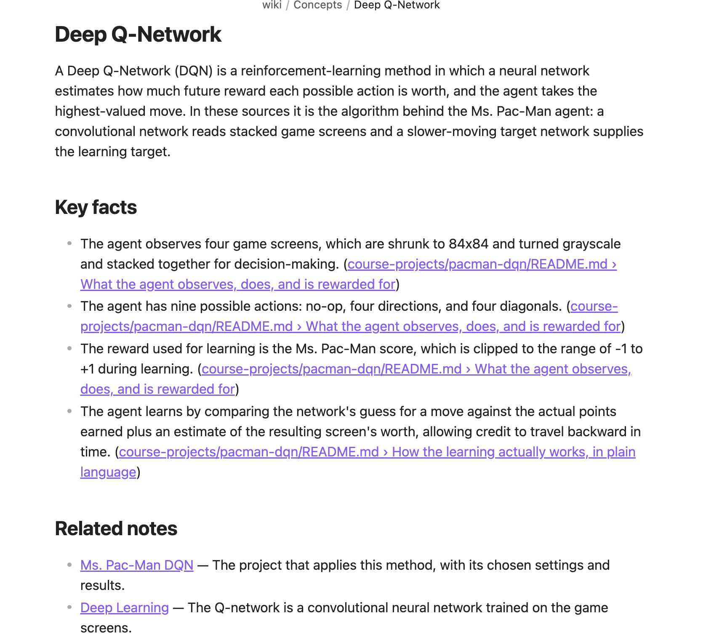
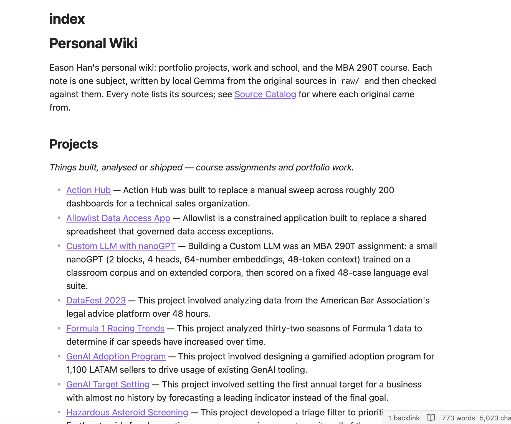
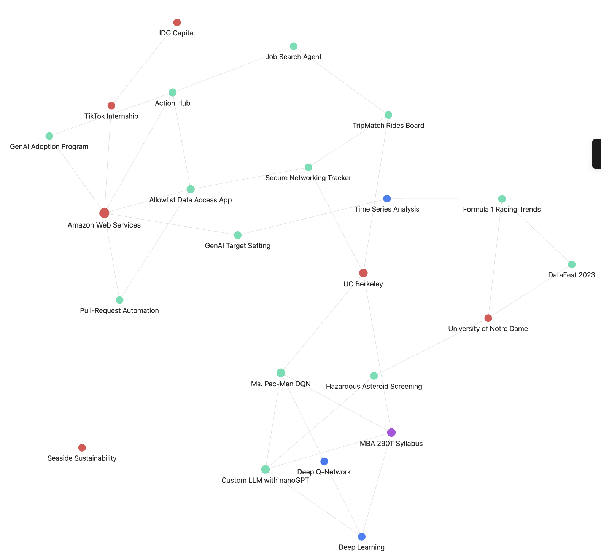
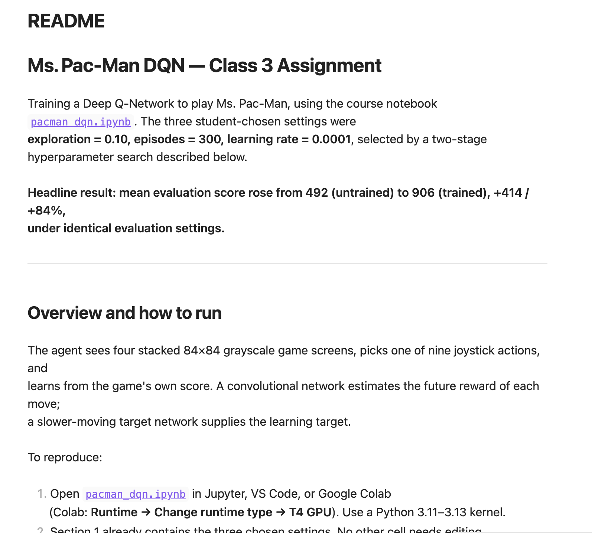

# Personal Wiki with Local Gemma + RAG

MBA 290T · Class 5 · Assignment 4 — Eason Han

A command-line personal wiki that runs **entirely on my laptop**. My own material (portfolio write-ups,
three MBA 290T project reports and the course syllabus) is kept unchanged in an Obsidian vault; a local
**Gemma 4 E4B** model turns it into linked, human-readable wiki notes; and my own harness answers from it in
three modes: **chat** (a personal assistant with a voice and memory of the conversation), **ask** (a neutral,
cited answer or an explicit "insufficient evidence"), and **search** (the original passages, no model).
The required demonstration (a fresh ingest, the four ask tests and the chat/search checks) ran on a 16 GB
MacBook Air with Wi-Fi switched off: see [§7](#7-evidence).

| Start here | |
|---|---|
| CLI and harness code | [`src/wiki/`](src/wiki/) — entry point [`cli.py`](src/wiki/cli.py), core [`harness.py`](src/wiki/harness.py) |
| The wiki (open this folder in Obsidian) | [`vault/`](vault/) — landing page [`vault/index.md`](vault/index.md), [`Source Catalog`](vault/Source%20Catalog.md) |
| Setup and commands | [Setup](#2-setup-and-device) · [Commands](#3-commands) |
| Four ask-mode evidence cards (offline run) | [T1](evidence/offline/ask/T1.md) · [T2](evidence/offline/ask/T2.md) · [T3](evidence/offline/ask/T3.md) · [T4](evidence/offline/ask/T4.md) · [summary](evidence/offline/summary.md) |
| Chat/search mode checks (offline run) | [evidence/offline/mode_checks.md](evidence/offline/mode_checks.md) |
| Offline demonstration | [full terminal transcript](evidence/offline/transcript-20260928-140540.txt) (Wi-Fi off, 14:05–15:06 on 2026-09-28) |
| Obsidian screenshots | [§6](#6-the-wiki-in-obsidian) · [`evidence/screenshots/`](evidence/screenshots/) |
| What went wrong and what I changed | [evidence/changes.md](evidence/changes.md) · wiki review log [evidence/wiki_review.md](evidence/wiki_review.md) |
| Measured memory and response time | [§2.4](#24-measured-memory-and-response-time) |
| Requirement-by-requirement checklist | [docs/REQUIREMENTS.md](docs/REQUIREMENTS.md) |

---

## 1. Purpose and sources

**What the wiki is for.** One place to ask "what did I actually do, and what did I learn?" about my
portfolio projects, jobs and the MBA 290T course, with every answer traceable to something I wrote or
received. The scope is small enough to verify by hand.

| Collection | Originals in `vault/raw/` | Where they came from |
|---|---|---|
| Personal website: projects | 13 case studies (`website/projects/*.md`; `kickstarter-scraper.md` was held back and ingested during the offline demonstration) | [easonhanyc.github.io](https://easonhanyc.github.io) source repo, commit `e8ea53c` |
| Personal website: experience | 6 entries (`website/experience/*.md`) | same repo and commit |
| MBA 290T course | `course/syllabus.html` | [course site syllabus](https://haas-ai-classes-fall-26.vercel.app/syllabus.html), captured 2026-09-26 (lecture slides deliberately excluded) |
| MBA 290T projects | Pac-Man DQN (README + methodology), Custom LLM (README), Secure Networking Tracker (README + how-it-works) | my public repos at pinned commits |

**How originals connect to generated pages.** Each original is stored byte-for-byte and listed with its
origin and sha256 in [`vault/Source Catalog.md`](vault/Source%20Catalog.md) (machine copy:
[`data/catalog.json`](data/catalog.json)). `wiki ingest` asks local Gemma to write one note per *subject*
(two sources about the same project merge into one note), and every fact in a note links back to the exact
file and section it came from, e.g. `[[raw/website/projects/pacman-dqn#1. The headline number, and why it flatters|…]]`.

## 2. Setup and device

### 2.1 Device

| | |
|---|---|
| Computer | MacBook Air (Mac14,2), **Apple M2**, 8-core CPU (4 performance + 4 efficiency), 8-core GPU, Metal 4 |
| Memory | **16 GB unified memory** (CPU and GPU share it; no separate VRAM). macOS allows the GPU about 12 GB of it (`MTL0 … 12124 MiB` in the llama.cpp log) |
| Available memory | With my usual apps open (browser, Office, Slack, Zoom, WeChat) the Mac was already using ~15 GB with 3–5 GB of swap before any model was loaded; `memory_pressure` reported 51% free. Measured values per run are in §2.4 |
| OS | macOS 26.6.2 (arm64) |
| Free disk | 86 GB before downloads, 79 GB after |
| Python | 3.12.14 (Homebrew) |

### 2.2 Choosing the Gemma model

"B" is billions of parameters. Google's Gemma 4 memory table (weights only, Q4_0 4-bit):

| Model | Load size at Q4_0 | What the name means | On this Mac |
|---|---|---|---|
| E2B | ~2.9 GB | "Effective" 2B: extra per-layer embedding tables make it larger than 2B in memory | fits easily; weaker at writing structured notes |
| **E4B** | **~4.5 GB** | Effective 4B, same per-layer-embedding design | **chosen**: fits with an 8K context and the embedder |
| 26B A4B (MoE) | ~14.4 GB | Mixture of experts: only ~4B parameters are *active* per token, but all 26B must be *loaded* | does not fit: above the ~12 GB the GPU may use, before context and apps |

The MoE's active-parameter count is about compute per token, not memory: routing can pick any expert for
any token, so every expert stays resident. I chose **E4B** because it is the largest size that leaves room
for the context, the embedding model and my other apps on 16 GB; ingestion needs a model that reliably
follows a JSON schema and keeps facts faithful to the source. The measured footprint (§2.4) confirms it fits.
E2B remains the fallback if memory pressure became a problem; I did not need to test it or the 26B.

**Exact model and runtime** ([`config/models.lock.json`](config/models.lock.json)):

| | |
|---|---|
| Generation model | `google/gemma-4-E4B-it-qat-q4_0-gguf`, file `gemma-4-E4B_q4_0-it.gguf` (5,154,941,280 bytes, sha256 `676c3507…daff453fbaee`, matches Hugging Face). Instruction-tuned, quantization-aware-trained **Q4_0**. Apache-2.0 |
| Embedding model | `ggml-org/embeddinggemma-300m-qat-q8_0-GGUF`, file `embeddinggemma-300m-qat-Q8_0.gguf` (328,577,056 bytes, sha256 `6fa0c02a…881b673f67`), 768-dim vectors |
| Runtime | llama.cpp `llama-server` 0.5.0 (build 11146, commit 7fe450e19), Homebrew bottle, Metal; all 43 layers on the GPU |
| Server settings | context 8,192 tokens, 1 slot, `--reasoning off` (thinking disabled for latency), bound to 127.0.0.1 |
| Weights location | `~/models/gemma/` — outside the repository, never committed |

### 2.3 Install (exact commands)

```bash
# 1. Runtime
brew install llama.cpp

# 2. Models (while online) — official files; checksums in config/models.lock.json
mkdir -p ~/models/gemma
curl -L -o ~/models/gemma/gemma-4-E4B_q4_0-it.gguf \
  https://huggingface.co/google/gemma-4-E4B-it-qat-q4_0-gguf/resolve/main/gemma-4-E4B_q4_0-it.gguf
curl -L -o ~/models/gemma/embeddinggemma-300m-qat-Q8_0.gguf \
  https://huggingface.co/ggml-org/embeddinggemma-300m-qat-q8_0-GGUF/resolve/main/embeddinggemma-300m-qat-Q8_0.gguf
shasum -a 256 ~/models/gemma/*.gguf

# 3. The CLI (Python 3.11+; dependencies: numpy, PyYAML)
git clone https://github.com/easonhanyc/mba290t-personal-wiki.git && cd mba290t-personal-wiki
python3 -m venv .venv && source .venv/bin/activate
pip install -e ".[test]"

# 4. Start the local model servers, build the wiki, try it
wiki serve start
wiki ingest vault/raw
wiki ask "What share of the final grade is attendance?"
```

Nothing after step 2 needs the internet.

### 2.4 Measured memory and response time

<!-- BEGIN:metrics -->
Measured 2026-09-27T01:12:52 with `scripts/measure.py` ([raw](evidence/metrics/local.json), [llama.cpp log](evidence/metrics/measure-gemma-server.log)). Other apps were open, as on a normal day.

| Memory | Value | Source |
|---|---|---|
| **Gemma server, resident memory** | **5,277 MB after load, 5,772 MB peak while answering** | `ps` RSS, sampled every second |
| of which: model file, memory-mapped | 4,901 MiB (GPU view of the whole 4.9 GB file; the 2,730 MiB of per-layer embedding tables read on the CPU are pages of the same file, not extra memory) | llama.cpp buffer accounting |
| of which: KV cache for the 8,192-token context | 168 MiB | llama.cpp |
| of which: compute buffers | 116 MiB GPU + 40 MiB CPU | llama.cpp |
| llama.cpp's fit projection at load | 2,980 MiB GPU + 2,810 MiB host = 5,790 MiB (of the ~12 GB macOS lets the M2 GPU use) | llama.cpp |
| EmbeddingGemma server, resident memory | 480 MB peak | `ps` RSS |
| `wiki` CLI process (a search) | 47.9 MB peak | `/usr/bin/time -l` |
| System memory in use, before → after loading both servers | 6.56 → 11.82 GB, with 7.3 GB swap already in use | `vm_stat`, `sysctl vm.swapusage` |
| Layers on the GPU | 43/43 | llama.cpp |

| Response time | Value |
|---|---|
| Ask mode, end to end (12 runs: 4 test questions × 3, prompt cache off) | median **19.0 s**, range 16.0–30.2 s |
| of which retrieval (BM25 + EmbeddingGemma query) | median 0.03 s |
| Prompt reading / answer writing speed | 122 / 9.9 tokens per second |
| Per question (median) | T1 20.8 s, T2 29.9 s, T3 17.4 s, T4 16.1 s |
| Gemma server start | 42.1 s the first time (file read from disk, Metal setup; [log](evidence/metrics/first-start-gemma-server.log)); 3.1 s on restart with the file cached |

| Ingestion run | Sources read | Model calls | Wall time | Tokens in / out | Note |
|---|---|---|---|---|---|
| [2026-09-26T23:12:00](runs/ingest-20260926-231200.json) | 1 (+0 unchanged) | 1 | 1.0 min | 764 / 489 | trial on one small source before the full run (that note was discarded and rebuilt) |
| [2026-09-27T00:48:31](runs/ingest-20260927-004831.json) | 24 (+0 unchanged) | 81 | 81.9 min | 132,343 / 35,394 |  |
| [2026-09-27T00:54:10](runs/ingest-20260927-005410-concepts.json) | 0 (+0 unchanged) | 8 | 4.5 min | 3,471 / 2,457 | 4 concept notes regenerated after fix #2 in evidence/changes.md |
| [offline transcript](evidence/offline/transcript-20260928-140540.txt) | 1 | (record overwritten, fix 12) | 3.4 min | — | **offline demonstration, Wi-Fi off**: the held-back Kickstarter source; the note itself took 113 s, the rest was the concept and link passes |
<!-- END:metrics -->

## 3. Commands

| Command | What it does |
|---|---|
| `wiki --help` / `wiki help ask` | Commands, configuration files, required inputs |
| `wiki serve start\|stop\|status` | Start/stop llama-server for Gemma (:8080) and EmbeddingGemma (:8081) |
| `wiki ingest [PATH…] [--force] [--dry-run] [--into DIR]` | Read sources, write or update notes with local Gemma, rebuild `index.md`, the Source Catalog and the search index. Unchanged files are skipped |
| `wiki search "words" [-k N] [--kind source\|wiki]` | Original passages with `path:lines › section`. **No model call, no generated answer**; works with Gemma stopped |
| `wiki ask "question" [--mode local\|online]` | Standalone cited answer or `Insufficient evidence:`; saved to `runs/ask-*.json` with the exact prompt |
| `wiki chat [--script FILE]` | Wren, the assistant. `/notes <topic>`, `/sources`, `/save`, `/reset`, `/exit` |
| `wiki check` | Lint the vault: names, headings, links, source references, index coverage |
| `wiki rename "Old" "New"` | Rename a note and update every incoming link, the catalog and the index |
| `wiki merge "Keep" "Remove" [--drop-facts]` | Fold a duplicate note into another (facts, sources, incoming links, catalog) and record a redirect so the removed subject never comes back |
| `wiki status` | Models present, servers running, vault and index size |

Errors are specific: a missing file names the path; a stopped model says `Start it with: wiki serve start`
(exit code 3) and never falls back to a cloud model; `--mode online` without a key says how to set one.

## 4. Architecture

```
            ┌───────────────────────── harness (src/wiki) ─────────────────────────┐
 user ──►  CLI ──► mode ──► instructions ──► context ──► retrieval? ──► prompt ──► model ──► checks ──► display + runs/
 (cli.py)          chat     persona.md       chat history  chat: router   harness.py  llm.py     citations   evidence
                   ask      research-rules   ask: none     ask: always                 │
                   search   —                —             search: only ─► (no model) ─┘
                   ingest   ingest-rules     —             —              JSON schema   │
                                                                                         ▼
                                     retrieval tool (retrieval.py)        llama-server on 127.0.0.1
                                     BM25 + EmbeddingGemma → RRF           Gemma 4 E4B (8080) · EmbeddingGemma (8081)
```

- **Model**: local Gemma generates text from the messages the harness sends. It reads no files, keeps no
  memory between calls, and operates no tools.
- **Retrieval tool** (`retrieval.py`): finds evidence. Passages from the originals (and reviewed notes) are
  ranked by BM25 and by EmbeddingGemma cosine similarity, and the two rankings are merged by reciprocal-rank
  fusion. It returns original text with `path:lines › section`. `wiki search` shows exactly this.
- **RAG workflow** (ask): retrieve → put numbered passages and the research rules in the prompt → Gemma
  answers from them → citations checked. RAG adds context at answer time; it does not train Gemma.
- **Harness** (`harness.py`, `ingest.py`, `vault.py`, `chat.py`): chooses the mode, loads that mode's
  instruction file, manages chat history, decides whether chat needs notes, budgets the context, calls the
  model, checks citations, handles errors and saves every run.
- **CLI** (`cli.py`): the terminal interface to the harness.

**One path, traced: `wiki ask "What share of the final grade is attendance…?"`**

1. `cli.main` parses the command and calls `cmd_ask`, which calls `harness.ask(question, mode="local")`.
   `ask` has no history parameter, so chat can never leak into it.
2. `llm.get_model("local")` returns `LocalGemma`, which refuses any non-localhost URL; `require()` checks
   `GET /health` and otherwise raises `ModelUnavailable` ("Start it with: wiki serve start").
3. `retrieval.Index.search` tokenizes the question for BM25, embeds it through EmbeddingGemma
   (`task: search result | query: …`), ranks every indexed passage both ways and fuses the top 30 of each.
4. `harness.select_within` keeps the best passages within a 2,200-token evidence budget and
   `passage_block` numbers them `[S1]…[S6]` with path, lines and section.
5. The messages are `system` = `instructions/research-rules.md`, `user` = passages + question. No persona.
6. `LocalGemma.chat` POSTs them to `http://127.0.0.1:8080/v1/chat/completions` (temperature 0.1, 350 tokens max).
7. `harness.check_citations` verifies every `[S#]` exists, flags sentences without a citation and numbers
   that do not appear in the cited passage, and recognises `Insufficient evidence:`.
8. `save_ask` writes `runs/ask-<time>.json` (passages, exact messages, answer, checks, timings); `cmd_ask`
   prints the answer, the sources (`*` = cited) and the check result.

## 5. Design choices

**Passages.** Split along the document's own headings; a passage never crosses a section. Target 200 words,
hard cap 300 words or 1,500 characters (dense tables tokenize at ~1 token per 2–3 characters, and the embedder
takes at most 2,048 tokens). Each passage keeps its file, heading path and original line numbers. Website
front matter (title, role, dates, outcomes) becomes one "Properties" passage so facts like a job title are
searchable. Inline SVG figures are reduced to their `<title>` caption; the raw files are never touched.

**Retrieval.** BM25 keyword search and EmbeddingGemma vectors both run locally and are fused by reciprocal rank
(k = 60); ask receives the top 6 passages. On the four test questions ([ablation](evidence/retrieval/ablation.md))
each method alone lost something the other kept: vectors alone missed the job-title passage for T3 (BM25 found it
at rank 6), and BM25 alone ranked T2's reworded evidence 4th where vectors ranked it 2nd. The hybrid kept both in
the top 6. Neither found the "three independent mechanisms" passage for T2 (see §8). If the embedding server is
down, search says so and uses BM25 alone.

**How much text reaches Gemma.** Ask: the research rules (~320 tokens), up to ~2,200 tokens of evidence
(all 6 passages fit in every test run) and the question; the measured prompts were 1,187–2,004 tokens, with
answers capped at 350. Chat: the persona with its capability list (~680 tokens), the most recent turns up to
~2,500 tokens, and up to 4 note passages (~1,400 tokens) only on turns that need them; a first chat turn
measured ~640 prompt tokens. Ingest: a source up to 1,800 words is sent whole;
longer sources are read in ~1,500-word parts (facts extracted per part), then the note is written from those
facts. The context window is 8,192 tokens; nothing sends the whole wiki.

**Research rules vs. personality** are separate files. [`research-rules.md`](instructions/research-rules.md)
(ask only): evidence only, neutral voice, `[S#]` after every claim, exact numbers, begin with
`Insufficient evidence:` when the passages do not answer. [`persona.md`](instructions/persona.md) (chat only):
Wren, a warm, concise chief of staff with a little dry humour; an accurate list of what it can and cannot do;
never invents personal facts; tags note-based claims `[N#]`; labels ideas as suggestions.

**When chat retrieves** (`ChatSession.route`, logged on every turn): casual, capability and edit requests
("what can you help me with?", "make that shorter") → no lookup; drafting or planning from what I said → no
lookup; a question about my own facts or naming a wiki subject (e.g. "Pac-Man", "TripMatch") → lookup;
anything else → a one-line JSON classification by Gemma. `/notes <topic>` forces a lookup. The history keeps
only what was said, not the retrieved passages.

**Note names and folders.** One subject per note, named the way a person would name the page (2–6 words;
first heading = file name). Gemma proposes a title; the harness removes subtitles and generic tails
("… Experience"), strips characters that break links, and rejects hashes, dates, task/chunk/export words and
sentence-like names, falling back to the source's own title. Folders: `Projects`, `Experience`, `Course`,
`Concepts`, the only categories these sources need. A same-name clash gets a meaningful qualifier
(`Memory - Computers`), never a random suffix.

**Source IDs → readable pages.** Machine IDs (`website-projects-pacman-dqn-2b1f…`), sha256 and original paths
live in each note's properties and in `data/catalog.json`; the catalog maps every original to the note(s)
built from it.

**Re-ingestion without duplicates.** An unchanged file (same sha256) is skipped. A changed or `--force`d
source updates the note the catalog already maps it to, at the same path, so a readable name can never be
replaced by a generated one. A new source about an existing subject merges into that note. Notes I have
reviewed are never overwritten; new facts for them are appended under "From <source>" and flagged
`needs_review`. Merges and renames leave a redirect in `data/catalog.json`, and the concept pass never
re-creates a redirected name: the offline run showed it could (fix 10 in
[evidence/changes.md](evidence/changes.md)), and the re-check in
[evidence/reingest_check.md](evidence/reingest_check.md) shows it no longer does.

**Guarding the generated wiki.** Gemma's JSON is schema-constrained. Any generated fact containing a number
that does not occur in the source is dropped automatically (listed in `runs/ingest-*.json`). Every note was
then read against its originals by hand; corrections are logged in [`evidence/wiki_review.md`](evidence/wiki_review.md).

## 6. The wiki in Obsidian

<!-- BEGIN:vault -->
25 originals in `vault/raw/`, 24 notes in `vault/wiki/`. `wiki check`: 420 links, 0 broken or ambiguous, 0 errors, 2 warnings.

| Folder | Notes |
|---|---|
| Projects (14) | Action Hub, Allowlist Data Access App, Custom LLM with nanoGPT, DataFest 2023, Formula 1 Racing Trends, GenAI Adoption Program, GenAI Target Setting, Hazardous Asteroid Screening, Job Search Agent, Kickstarter Scraper, Ms. Pac-Man DQN, Pull-Request Automation, Secure Networking Tracker, TripMatch Rides Board |
| Experience (6) | Amazon Web Services, IDG Capital, Seaside Sustainability, TikTok Internship, UC Berkeley, University of Notre Dame |
| Course (1) | MBA 290T Syllabus |
| Concepts (3) | Deep Learning, Deep Q-Network, Time Series Analysis |
<!-- END:vault -->

Open `vault/` itself as the vault (not the repository). `index.md` is the landing page; `raw/` holds the
unchanged originals, `wiki/` the reviewed notes in four topic folders. Screenshots from Obsidian 1.13.7, taken on
2026-09-27, before the offline demonstration added the 24th note (*Kickstarter Scraper*):

**1. An open note** — the breadcrumb `wiki / Concepts / Deep Q-Network` is the file path and matches the heading;
every fact ends with a link to the exact section of the original it came from; related notes say why they are linked.



**2. The landing page** — `index.md`, grouped by topic with one line per note.



**3. The graph** — filter `path:wiki/` (curated notes only), attachments hidden, colour groups by folder (saved in
`vault/.obsidian/graph.json`). Every label is a subject name. *Seaside Sustainability* stands alone on purpose:
Gemma had linked it to AWS and the GenAI programme with false reasons, and nothing else in this wiki shares its
subject, so those links were removed rather than kept for a denser picture.



**4. Following a source reference** — from the Deep Q-Network note's facts, the link opens the original
`raw/course-projects/pacman-dqn/README.md` itself (never an edited copy).



**A trace through the wiki:** `index.md` → *Deep Q-Network* → its related note *Ms. Pac-Man DQN* → a fact such as
"The replay buffer holds only 5,000 transitions — about seven games" → its link opens
`raw/course-projects/pacman-dqn/docs/METHODOLOGY.md` at *The problem with guessing*, where that sentence appears.
The [Source Catalog](vault/Source%20Catalog.md) lists every original with its repository commit or URL, its sha256
and the notes built from it. `wiki check` confirms every link resolves to exactly one file, every heading matches
its file name and every note cites at least one original; re-ingesting all sources leaves every note byte-identical
([evidence/reingest_check.md](evidence/reingest_check.md)).

## 7. Evidence

<!-- BEGIN:eval -->
Run `offline` at 2026-09-28T14:12:39; internet **offline**; model `gemma-4-e4b-it-qat-q4_0` (file sha256 matches Hugging Face: True); 514 passages indexed.

| Test | Question | Expected evidence retrieved | Answer (first sentence) | Citation check | Time | Assessment |
|---|---|---|---|---|---|---|
| [T1](evidence/offline/ask/T1.md) | What share of the final grade is attendance, and how many classes can be missed without penalty? | E1 yes (S1); E2 yes (S2) | Attendance is worth 20% of the final grade [S1][S2][S5]. | ok | 6.24 s | Pass |
| [T2](evidence/offline/ask/T2.md) | In the app I built to track people I meet, what stops one user from seeing someone else's list? | E1 no; E2 yes (S2) | Ownership is enforced by Postgres through Row Level Security [S1][S2]. | ok | 13.62 s | Pass, but incomplete |
| [T3](evidence/offline/ask/T3.md) | What was my job title at Amazon Web Services, and by how much did the Action Hub cut sellers' time-to-insight? | E1 yes (S5); E2 yes (S1) | The job title at Amazon Web Services was Business Intelligence Engineer — Global Sales Strategy & Analytics [S3][S5]. | ok | 5.69 s | Pass |
| [T4](evidence/offline/ask/T4.md) | What grade did I receive on the Pac-Man assignment? | n/a | Insufficient evidence: The provided passages detail the training parameters, results, and methodology for the Ms. Pac-Man DQN assignment, but they do not state what grade was received. | insufficient-evidence | 4.0 s | Pass |

| Check | Result | Assessment |
|---|---|---|
| [M1 casual chat, capabilities](evidence/offline/mode_checks.md) | "what can you help me with?" → no lookup; "what can we do?" → no lookup | Pass |
| [M2 conversational follow-up](evidence/offline/mode_checks.md) | "Draft a short plan for my week: I need t" → no lookup; "make that shorter" → no lookup | Pass |
| [M3 raw search](evidence/offline/mode_checks.md) | 6 original passages, 0 model calls, Gemma running: False | Pass |
| [M4 ask ignores chat history](evidence/offline/mode_checks.md) | ask: "Insufficient evidence: The provided passages describe course…"; chat claim in ask prompt: False | Pass |
<!-- END:eval -->

### The offline demonstration

Eason switched Wi-Fi off and ran `./scripts/offline_demo.sh`; the whole session is in
[`transcript-20260928-140540.txt`](evidence/offline/transcript-20260928-140540.txt). In order, it shows:

1. **No internet**: `Wi-Fi Power (en0): Off`, no default route, and HTTPS to `1.1.1.1` and `huggingface.co` failing
   (checked again at the end).
2. **A fresh start in local mode**: `wiki serve stop` / `start`, `wiki status`, `wiki --help`.
3. **Errors and search without the model**: with Gemma stopped, `wiki ask` exits with *"Local Gemma is not running
   … Start it with: wiki serve start (No cloud fallback is used)"* (exit code 3), while `wiki search` still returns
   original passages.
4. **Offline ingestion**: the held-back `kickstarter-scraper.md` is copied into `raw/` byte-for-byte and becomes the
   note *Kickstarter Scraper* in 113 s; ingesting it again and re-ingesting all 25 originals change nothing; `wiki check`
   finds 0 broken links. This step also exposed a real bug (fix 10 below).
5. **The four ask tests** through the CLI, then the **chat and search checks**, then `scripts/run_evals.py`, which
   re-runs them through the same harness code to write the evidence cards above (their times are shorter because
   the identical prompts had just been run, so llama.cpp reused its prompt cache; the representative figure is the
   19 s median in §2.4).
6. **A live chat typed by Eason**: capabilities, a LinkedIn post drafted from the Pac-Man notes (the numbers match
   the sources), and "make that shorter" rewriting it from the conversation.

An earlier attempt the same afternoon stopped at step 1 even though Wi-Fi was off
([`transcript-20260928-134059.txt`](evidence/offline/transcript-20260928-134059.txt), kept): the script judged the
internet by a raw TCP connection to `1.1.1.1:53`, which the Cisco AnyConnect network extension on this Mac answers
locally. It now requires a real HTTPS request (fix 9). The online dry run that preceded the offline run, with its
routing bug, is kept in [`evidence/local-dryrun/`](evidence/local-dryrun/summary.md).

Also kept: retrieval checks before any generation ([baseline](evidence/retrieval/baseline-sources-only.md), with
reviewed notes [indexed](evidence/retrieval/with-reviewed-notes.md), [ablation](evidence/retrieval/ablation.md)); the
[wiki review log](evidence/wiki_review.md); the [cleanup log](evidence/cleanup_log.md); and every model call's exact
prompt under `runs/`.

## 8. Reflection

**The main limitation: retrieval, not the model, decided T2.** The reworded question *"In the app I built to track
people I meet, what stops one user from seeing someone else's list?"* never retrieved the passage that states the
answer in full ("Three independent mechanisms enforce it…"). Among the 520 indexed passages it ranks 80th by BM25
and 19th by vector similarity, because it is written in the source's vocabulary (JWT, `user_id`, policies) while the
question uses none of it. Gemma
did the right thing with what it was given: every claim in its answer is supported, and it explained Row Level
Security, but it could not mention the other two mechanisms it never saw. A fluent, correct and cited answer can
still be incomplete, and only the retrieval check makes that visible. **Improvement I would try:** retrieve at two
levels. First match the question to wiki notes (searching notes only, *Secure Networking Tracker* already ranks 2nd,
behind *Allowlist*, which is also about who may see which records), then search only within those notes' sources.
The notes would become an index into the originals, which is what they are for; whether that recovers the missing
passage is the next thing I would measure with `scripts/retrieval_check.py`.

Other failures are logged with their fixes in [evidence/changes.md](evidence/changes.md). The ones worth knowing:

- **Generated links were the least reliable part of ingestion.** Gemma proposed plausible but false relations
  ("Formula 1 … uses a Deep Q-Network") and concept notes that were really the syllabus. Facts were mostly faithful
  (numbers are checked automatically), but every link needed a human check.
- **Chat did not cite notes in a creative turn.** Asked to draft LinkedIn posts, Wren used the Pac-Man notes
  correctly but tagged none of the facts `[N#]`, although its instructions say to; the harness flagged it
  (`citation check: no-citations`). The fix I would make is in the harness, not the prompt: when notes were used and
  no tags came back, append a "Based on" line listing the notes, so a drafted post can always be traced.
- **A merged note came back** during the offline ingest; merges now leave redirects (fix 10).

## 9. Optional online mode (extension)

Local mode is the default and everything above runs without it. `--mode online` sends the same harness
prompts to **hosted Gemma 4 26B A4B** (`gemma-4-26b-a4b-it`) through the Gemini API — the MoE model that does
not fit on this laptop.

- Select it: `export GEMINI_API_KEY=…` (create a key in Google AI Studio), then `wiki ask "…" --mode online`
  or `wiki chat --mode online`. Without the key the command stops with an explanation; there is never an
  automatic switch from local to online.
- Data sent to Google: the instruction file for the mode, the retrieved passages and the question (ask), or
  the persona, recent conversation and any retrieved notes (chat). Retrieval, the index and the vault stay local.
- Online results are labelled `online` in every header and record, and kept apart from the offline evidence.
- **Status: implemented but not exercised for this submission** (no API key was used). `./scripts/online_check.sh`
  runs the four ask tests online into `evidence/online/` once a key is exported. Nothing in the required local
  workflow depends on it.

## 10. Reproduce the checks

```bash
pytest -q                                         # harness logic with a fake model (no Gemma needed)
python scripts/retrieval_check.py --label now     # retrieval only, for the four ask tests
python scripts/run_evals.py --label local         # four ask tests + mode checks -> evidence/local/
python scripts/measure.py --label local           # memory and response time -> evidence/metrics/
python scripts/build_readme_tables.py             # refresh the tables in this README from evidence/
wiki check                                        # vault lint: names, headings, links, source references
python scripts/review_notes.py                    # each unreviewed note's facts next to the passages they cite
./scripts/offline_demo.sh                         # with Wi-Fi off: the full offline demonstration
```
