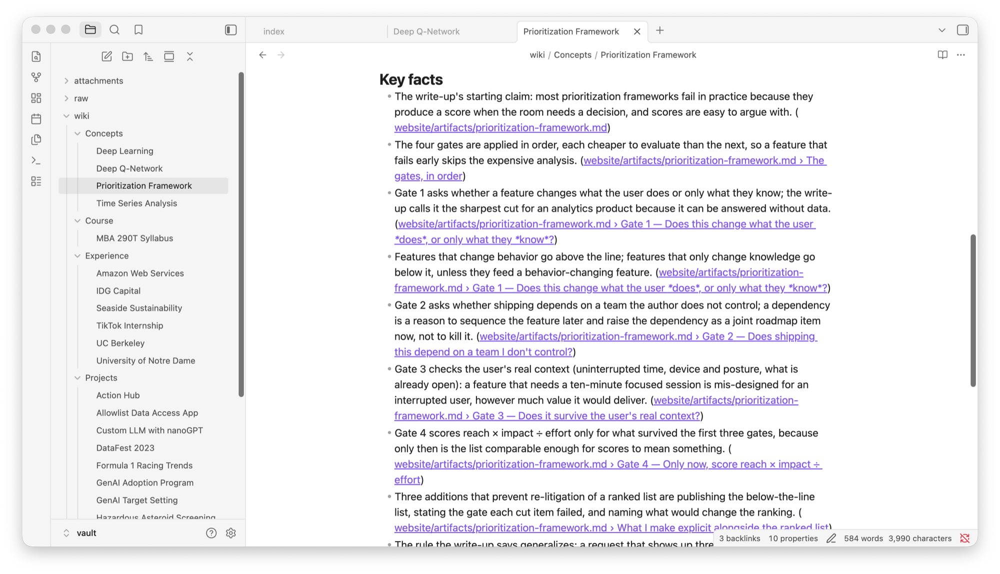
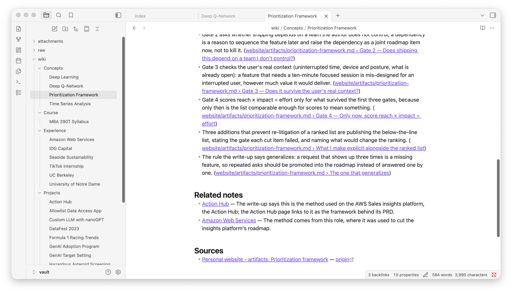
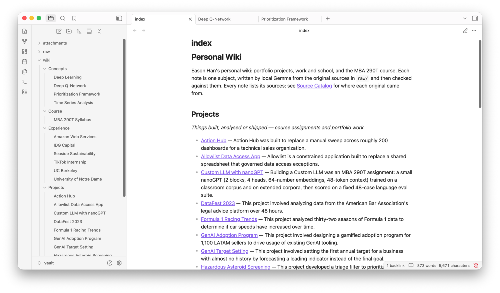
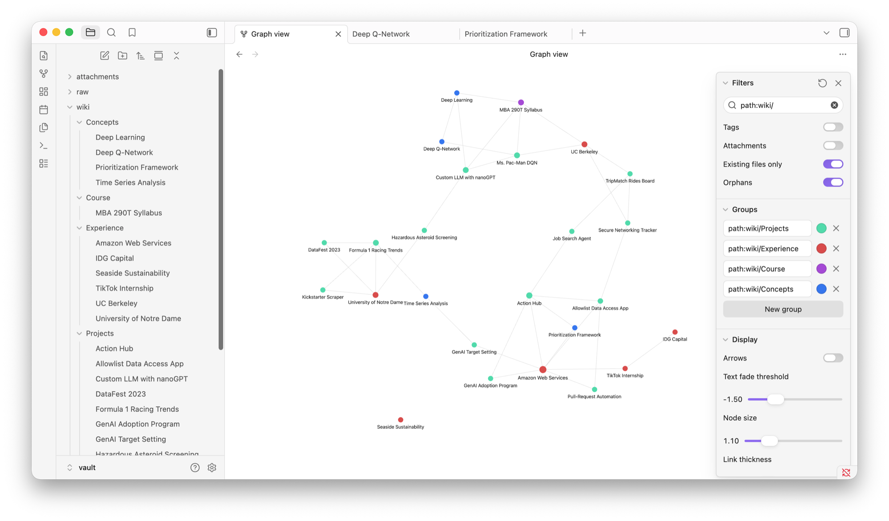
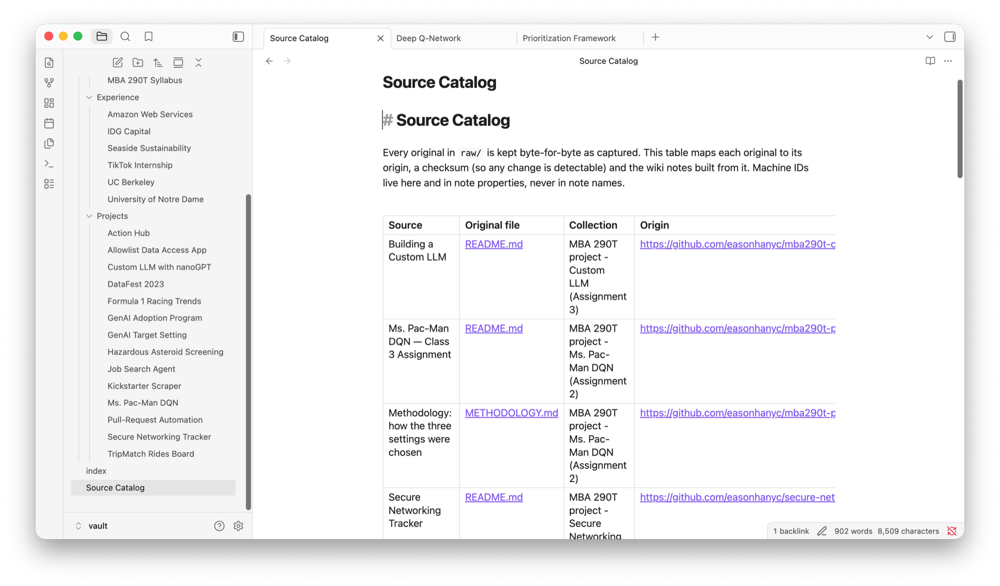
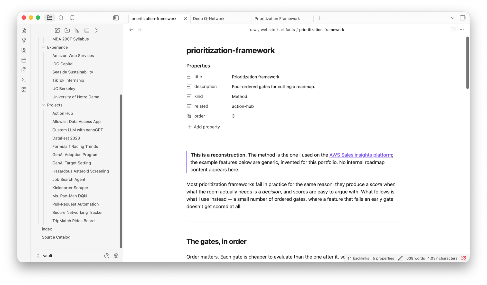
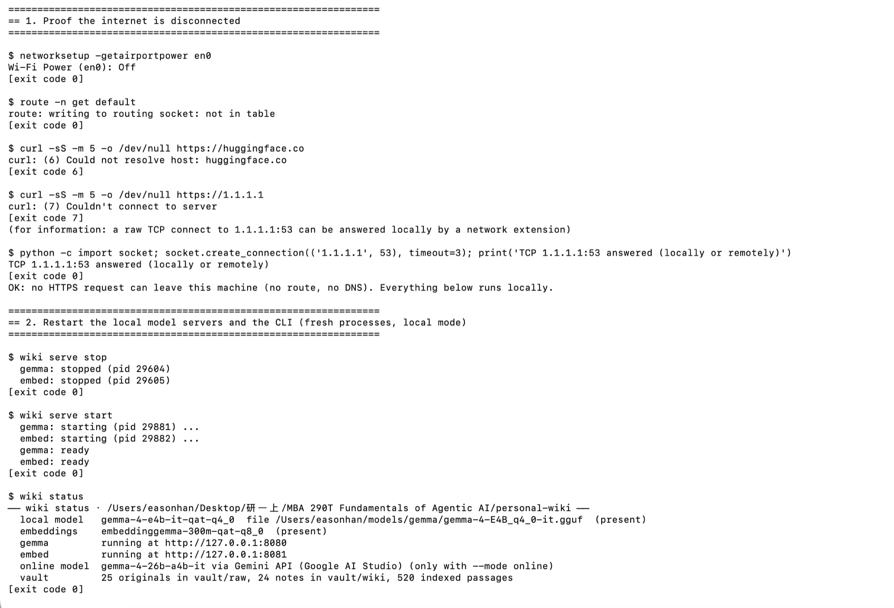
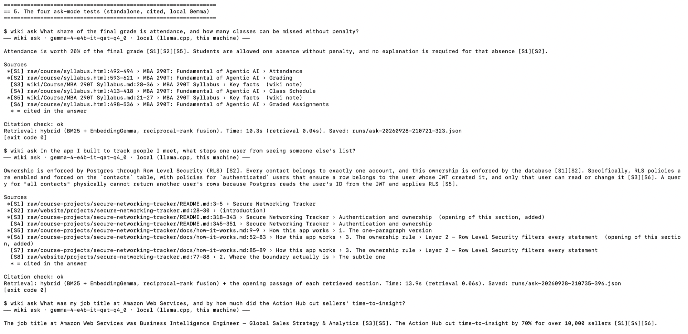

# Personal Wiki with Local Gemma + RAG

MBA 290T · Class 5 · Assignment 4 — Eason Han

## Overview for graders

**What it is.** My own command-line tool and harness (about 3,000 lines of Python in [`src/wiki/`](src/wiki/), 26 unit
tests) that turns my own material into an Obsidian wiki and answers from it with **Gemma 4 E4B running on my
laptop**. The sources are 26 unchanged originals: my portfolio write-ups, three MBA 290T project reports and the course
syllabus. Local Gemma wrote 25 linked notes from them, and I reviewed every note against its sources. The harness offers
three modes: **chat** (Wren, a personal assistant that remembers the conversation and looks up notes only when needed),
**ask** (a neutral, cited answer, or "Insufficient evidence") and **search** (original passages, no model).
llama.cpp is used only to run the model; retrieval, prompts, routing, citation checks and logging are my code.

**Model and device.** `google/gemma-4-E4B-it-qat-q4_0-gguf` (Gemma 4 E4B, instruction-tuned, 4-bit QAT Q4_0) in
llama.cpp `llama-server` 0.5.0 on a MacBook Air M2 with 16 GB unified memory. Measured: 5.3–5.8 GB resident; answers in 8–30 s
(median 19.0 s over 12 timed runs); one new source ingested offline in 50 s and 3.4 min in the two offline runs. Retrieval is my BM25 plus EmbeddingGemma-300M vectors,
all on `127.0.0.1`.

**What the evidence shows**, by grading component:

| Component | What the brief asks for | Where it is | Result |
|---|---|---|---|
| Deliverable quality (4) | Readable harness code | [`src/wiki/`](src/wiki/): `cli` → `harness` → `retrieval` / `llm`; one command traced in [§4](#4-architecture) | modular, 26 tests pass |
| | Wiki usable in Obsidian: short names, topic navigation, readable graph, meaningful links | [`vault/`](vault/), [§6](#6-the-wiki-in-obsidian), 16 screenshots | 25 notes in 4 folders, grouped `index.md`, graph filtered to `path:wiki/`, 436 links, 0 broken |
| | Traceable sources | [Source Catalog](vault/Source%20Catalog.md); every fact links to the section it came from | all 26 originals byte-identical to their upstream copies (25 at pinned repo commits, the syllabus to the live page; re-checked 2026-09-28) |
| | Clear setup | [§2.3](#23-install-exact-commands) exact commands | re-run from a fresh clone ([log](evidence/setup-check-20260928-215251.txt)) |
| | How my data reaches the model | [§4](#4-architecture), [§5](#5-design-choices) | chunking, hybrid retrieval, token budgets, prompts |
| Testing & evaluation (3) | 3 answerable + 1 unsupported ask test with expected evidence, retrieved passages, answers, checked citations | [§7](#7-evidence), [cards](evidence/offline-2/summary.md) | T1, T3, T4 pass; T2 passes but is incomplete (explained) |
| | Retrieval checked before answers | [`evidence/retrieval/`](evidence/retrieval/) | the T2 miss was found this way and fixed (fix 14) |
| | Chat/search mode checks | [mode checks](evidence/offline-2/mode_checks.md) | M2–M5 pass; M1 partly failed on a stray tag, fixed (fix 16) |
| | Proof of offline execution | [§7](#7-evidence): 2 transcripts, 11 screenshots | Wi-Fi off, no route, HTTPS failing, before and after |
| | Failures explained honestly | [changes.md](evidence/changes.md) (17 fixes), [§8](#8-reflection) | every earlier result kept |
| Working result (3) | Local Gemma, ingestion, chat, ask and search through my harness with no internet | [second offline run](#the-second-offline-run) | a new source ingested offline (50 s), all tests and checks run, plus a live chat |

**Run it** (after the [setup](#23-install-exact-commands); everything runs on `127.0.0.1`):

```bash
wiki serve start                                   # start local Gemma and EmbeddingGemma
wiki --help                                        # commands, configuration, inputs
wiki search "row level security"                   # original passages, no model
wiki ask "What share of the final grade is attendance?"
wiki chat                                          # Wren; try "what can you help me with?"
wiki ingest path/to/new-note.md                    # add a source; re-ingesting creates no duplicates
```

**Online mode** (optional extension, off by default): the same CLI with `--mode online`, which sends the prompt to
hosted Gemma 4 26B through the Gemini API. There is no website; a web interface is optional in the brief.
`export GEMINI_API_KEY=…` then `wiki ask "…" --mode online` or `wiki chat --mode online`. Details and tested
results: [§9](#9-optional-online-mode-extension), [`evidence/online/`](evidence/online/summary.md).

**Known limitations, stated up front:**
- T2 now retrieves every passage it needs, but E4B still leaves out two of the three mechanisms they list.
- M1's stray `[N1]` tag was fixed after the second offline run and re-checked with the internet on.
- The note sections that list related notes compete with real evidence in retrieval.

All three are in [§8](#8-reflection).

| Start here | |
|---|---|
| CLI and harness code | [`src/wiki/`](src/wiki/) — entry point [`cli.py`](src/wiki/cli.py), core [`harness.py`](src/wiki/harness.py) |
| The wiki (open this folder in Obsidian) | [`vault/`](vault/) — landing page [`vault/index.md`](vault/index.md), [`Source Catalog`](vault/Source%20Catalog.md) |
| Setup and commands | [Setup](#2-setup-and-device) · [Commands](#3-commands) · setup re-run from a fresh clone, with error messages: [log](evidence/setup-check-20260928-215251.txt) |
| Four ask-mode evidence cards (second offline run) | [T1](evidence/offline-2/ask/T1.md) · [T2](evidence/offline-2/ask/T2.md) · [T3](evidence/offline-2/ask/T3.md) · [T4](evidence/offline-2/ask/T4.md) · [summary](evidence/offline-2/summary.md) — first offline run, kept: [summary](evidence/offline/summary.md) |
| Chat/search mode checks (second offline run) | [evidence/offline-2/mode_checks.md](evidence/offline-2/mode_checks.md) — first run: [evidence/offline/mode_checks.md](evidence/offline/mode_checks.md) |
| Offline demonstration | Second run: [transcript](evidence/offline-2/transcript-20260928-210530.txt) and [11 screenshots](#the-second-offline-run) (Wi-Fi off, 21:05–21:22). First run: [transcript](evidence/offline/transcript-20260928-140540.txt) (14:05–15:06) |
| Obsidian screenshots | [§6](#6-the-wiki-in-obsidian) · [`evidence/screenshots/obsidian-2026-09-28/`](evidence/screenshots/obsidian-2026-09-28/) |
| Optional online mode | [§9](#9-optional-online-mode-extension) · [`evidence/online/`](evidence/online/summary.md) (labelled separately from the offline evidence) |
| What went wrong and what I changed | [evidence/changes.md](evidence/changes.md) · wiki review log [evidence/wiki_review.md](evidence/wiki_review.md) |
| Measured memory and response time | [§2.4](#24-measured-memory-and-response-time) |
| Requirement-by-requirement checklist | [docs/REQUIREMENTS.md](docs/REQUIREMENTS.md) |

---

## 1. Purpose and sources

**What the wiki is for.** One place to ask "what did I actually do, and what did I learn?" about my
portfolio projects, jobs and the MBA 290T course, with every answer traceable to something I wrote or
received. The scope is small enough to verify by hand.

| Collection | Originals in `vault/raw/` | Where they came from |
|---|---|---|
| Personal website: projects | 13 case studies (`website/projects/*.md`; `kickstarter-scraper.md` was held back and ingested during the offline demonstration) | [easonhanyc.github.io](https://easonhanyc.github.io) source repo, commit `e8ea53c` |
| Personal website: experience | 6 entries (`website/experience/*.md`) | same repo and commit |
| Personal website: artifacts | `website/artifacts/prioritization-framework.md`, held back and ingested during the second offline run | same repo and commit |
| MBA 290T course | `course/syllabus.html` | [course site syllabus](https://haas-ai-classes-fall-26.vercel.app/syllabus.html), captured 2026-09-26 (lecture slides deliberately excluded) |
| MBA 290T projects | Pac-Man DQN (README + methodology), Custom LLM (README), Secure Networking Tracker (README + how-it-works) | my public repos at pinned commits |

All sources are shareable: my own website and repositories (all public) and the course's public syllabus page;
the instructors' lecture slides were deliberately left out.

**How originals connect to generated pages.** Each original is stored byte-for-byte and listed with its
origin and sha256 in [`vault/Source Catalog.md`](vault/Source%20Catalog.md) (machine copy:
[`data/catalog.json`](data/catalog.json)). `wiki ingest` asks local Gemma to write one note per *subject*
(two sources about the same project merge into one note), and every fact in a note links back to the exact
file and section it came from, e.g. `[[raw/website/projects/pacman-dqn#1. The headline number, and why it flatters|…]]`.

## 2. Setup and device

### 2.1 Device

| | |
|---|---|
| Computer | MacBook Air (Mac14,2), **Apple M2**, 8-core CPU (4 performance + 4 efficiency), 8-core GPU, Metal 4 |
| Memory | **16 GB unified memory** (CPU and GPU share it; no separate VRAM). macOS allows the GPU about 12 GB of it (`MTL0 … 12124 MiB` in the llama.cpp log) |
| Available memory | With my usual apps open (browser, Office, Slack, Zoom, WeChat) the Mac was already using ~15 GB with 3–5 GB of swap before any model was loaded; `memory_pressure` reported 51% free. Measured values per run are in §2.4 |
| OS | macOS 26.6.2 (arm64) |
| Free disk | 86 GB before downloads, 79 GB after |
| Python | 3.12.14 (Homebrew) |

### 2.2 Choosing the Gemma model

"B" is billions of parameters. From the official Gemma documentation's
[memory table](https://ai.google.dev/gemma/docs/core#gemma-4-inference-memory-requirements) (weights only, Q4_0 4-bit):

| Model | Load size at Q4_0 | What the name means | On this Mac |
|---|---|---|---|
| E2B | ~2.9 GB | "Effective" 2B: extra per-layer embedding tables make it larger than 2B in memory | fits easily; not tested |
| **E4B** | **~4.5 GB** | Effective 4B, same per-layer-embedding design | **chosen**: fits with an 8K context and the embedder |
| 26B A4B (MoE) | ~14.4 GB | Mixture of experts: only ~4B parameters are *active* per token, but all 26B must be *loaded* | does not fit: above the ~12 GB the GPU may use, before context and apps |

The MoE's active-parameter count is about compute per token, not memory: routing can pick any expert for
any token, so every expert stays resident.

**Why E4B.** The brief asks for the smallest model that works for the wiki. E4B is the smallest I verified: it wrote
all 25 notes through a JSON schema (with the checks in §5), answered the four tests as assessed in §7, and peaked at
5.8 GB on this 16 GB Mac while answering and 5.5 GB while ingesting (§2.4). I did not test E2B, so I make no claim
that it would fail. I started with E4B because ingestion is the harder job (following a schema and keeping facts
faithful over long sources) and E4B fits with room to spare; E2B is the documented fallback if memory runs short. The
26B does not fit here and runs only in the optional online mode. The GGUF files contain their own tokenizers, so the
two model files are the only downloads a model needs.

**Exact model and runtime** ([`config/models.lock.json`](config/models.lock.json)):

| | |
|---|---|
| Generation model | `google/gemma-4-E4B-it-qat-q4_0-gguf`, file `gemma-4-E4B_q4_0-it.gguf` (5,154,941,280 bytes, sha256 `676c3507…daff453fbaee`, matches Hugging Face). Instruction-tuned, quantization-aware-trained **Q4_0**. Apache-2.0 |
| Embedding model | `ggml-org/embeddinggemma-300m-qat-q8_0-GGUF`, file `embeddinggemma-300m-qat-Q8_0.gguf` (328,577,056 bytes, sha256 `6fa0c02a…881b673f67`), 768-dim vectors |
| Runtime | llama.cpp `llama-server` 0.5.0 (build 11146, commit 7fe450e19), Homebrew bottle, Metal; all 43 layers on the GPU |
| Server settings | context 8,192 tokens, 1 slot, `--reasoning off` (thinking disabled for latency), bound to 127.0.0.1 |
| Weights location | `~/models/gemma/` — outside the repository, never committed |

### 2.3 Install (exact commands)

```bash
# 1. Runtime
brew install llama.cpp

# 2. Models (while online) — official files; checksums in config/models.lock.json
mkdir -p ~/models/gemma
curl -L -o ~/models/gemma/gemma-4-E4B_q4_0-it.gguf \
  https://huggingface.co/google/gemma-4-E4B-it-qat-q4_0-gguf/resolve/main/gemma-4-E4B_q4_0-it.gguf
curl -L -o ~/models/gemma/embeddinggemma-300m-qat-Q8_0.gguf \
  https://huggingface.co/ggml-org/embeddinggemma-300m-qat-q8_0-GGUF/resolve/main/embeddinggemma-300m-qat-Q8_0.gguf
shasum -a 256 ~/models/gemma/*.gguf

# 3. The CLI (Python 3.11+; dependencies: numpy, PyYAML)
git clone https://github.com/easonhanyc/mba290t-personal-wiki.git && cd mba290t-personal-wiki
python3 -m venv .venv && source .venv/bin/activate
pip install -e ".[test]"

# 4. Start the local model servers, build the wiki, try it
wiki serve start
wiki ingest vault/raw
wiki ask "What share of the final grade is attendance?"
```

Nothing after step 2 needs the internet.

### 2.4 Measured memory and response time

<!-- BEGIN:metrics -->
Measured 2026-09-27T01:12:52 with `scripts/measure.py` ([raw](evidence/metrics/local.json), [llama.cpp log](evidence/metrics/measure-gemma-server.log)). Other apps were open, as on a normal day.

| Memory | Value | Source |
|---|---|---|
| **Gemma server, resident memory** | **5,277 MB after load, 5,772 MB peak while answering** | `ps` RSS, sampled every second |
| of which: model file, memory-mapped | 4,901 MiB (GPU view of the whole 4.9 GB file; the 2,730 MiB of per-layer embedding tables read on the CPU are pages of the same file, not extra memory) | llama.cpp buffer accounting |
| of which: KV cache for the 8,192-token context | 168 MiB | llama.cpp |
| of which: compute buffers | 116 MiB GPU + 40 MiB CPU | llama.cpp |
| llama.cpp's fit projection at load | 2,980 MiB GPU + 2,810 MiB host = 5,790 MiB (of the ~12 GB macOS lets the M2 GPU use) | llama.cpp |
| EmbeddingGemma server, resident memory | 480 MB peak | `ps` RSS |
| `wiki` CLI process (a search) | 47.9 MB peak | `/usr/bin/time -l` |
| System memory in use, before → after loading both servers | 6.56 → 11.82 GB, with 7.3 GB swap already in use | `vm_stat`, `sysctl vm.swapusage` |
| Layers on the GPU | 43/43 | llama.cpp |

| Response time | Value |
|---|---|
| Ask mode, end to end (12 runs: 4 test questions × 3, prompt cache off) | median **19.0 s**, range 16.0–30.2 s |
| of which retrieval (BM25 + EmbeddingGemma query) | median 0.03 s |
| Prompt reading / answer writing speed | 122 / 9.9 tokens per second |
| Per question (median) | T1 20.8 s, T2 29.9 s, T3 17.4 s, T4 16.1 s |
| Gemma server start | 42.1 s the first time (file read from disk, Metal setup; [log](evidence/metrics/first-start-gemma-server.log)); 3.1 s on restart with the file cached |

| Ingestion run | Sources read | Model calls | Wall time | Tokens in / out | Note |
|---|---|---|---|---|---|
| [2026-09-26T23:12:00](runs/ingest-20260926-231200.json) | 1 (+0 unchanged) | 1 | 1.0 min | 764 / 489 | trial on one small source before the full run (that note was discarded and rebuilt) |
| [2026-09-27T00:48:31](runs/ingest-20260927-004831.json) | 24 (+0 unchanged) | 81 | 81.9 min | 132,343 / 35,394 |  |
| [2026-09-27T00:54:10](runs/ingest-20260927-005410-concepts.json) | 0 (+0 unchanged) | 8 | 4.5 min | 3,471 / 2,457 | 4 concept notes regenerated after fix #2 in evidence/changes.md |
| [2026-09-28T21:06:58](runs/ingest-20260928-210658-465.json) | 1 (+0 unchanged) | 2 | 0.8 min | 3,378 / 934 | **second offline demonstration, Wi-Fi off**: the held-back `prioritization-framework.md` (the note itself took 42 s) |
| [offline transcript](evidence/offline/transcript-20260928-140540.txt) | 1 | (record overwritten, fix 12) | 3.4 min | — | **first offline demonstration, Wi-Fi off**: the held-back Kickstarter source; the note itself took 113 s, the rest was the concept and link passes |
<!-- END:metrics -->

**Memory while ingesting** ([`scripts/measure_ingest_memory.py`](scripts/measure_ingest_memory.py),
[raw](evidence/metrics/ingest-memory.json)): with the Gemma server freshly restarted, as for the answer measurement
(macOS pages an idle model out, so `ps` figures are only comparable right after a load),
re-ingesting one source (41.7 s, 1 model call, on a throwaway copy of the project) took its resident memory from
5,277 MB to a peak of **5,451 MB**. Ingesting needs no more memory than answering, because both use the same loaded
model and the KV cache is allocated for the whole 8,192-token context at load time.

The ask timings above were measured on 2026-09-27, before section openings were added (fix 14). In the second offline
run the four CLI asks, each the first run of its prompt on a freshly restarted server, took 10.3, 13.9, 8.2 and
8.3 s with prompts of 2,004, 2,062, 1,409 and 1,627 tokens ([transcript](evidence/offline-2/transcript-20260928-210530.txt),
step 5; records under `runs/ask-20260928-2107*`). Conditions differ between the two days (other apps open, swap), so
the two sets are reported separately rather than merged.

## 3. Commands

| Command | What it does |
|---|---|
| `wiki --help` / `wiki help ask` | Commands, configuration files, required inputs |
| `wiki serve start\|stop\|status` | Start/stop llama-server for Gemma (:8080) and EmbeddingGemma (:8081) |
| `wiki ingest [PATH…] [--force] [--dry-run] [--into DIR]` | Read sources, write or update notes with local Gemma, rebuild `index.md`, the Source Catalog and the search index. Unchanged files are skipped |
| `wiki search "words" [-k N] [--kind source\|wiki]` | Original passages with `path:lines › section`. **No model call, no generated answer**; works with Gemma stopped |
| `wiki ask "question" [--mode local\|online]` | Standalone cited answer or `Insufficient evidence:`; saved to `runs/ask-*.json` with the exact prompt |
| `wiki chat [--script FILE]` | Wren, the assistant. `/notes <topic>`, `/sources`, `/save`, `/reset`, `/exit` |
| `wiki check` | Lint the vault: names, headings, links, source references, index coverage |
| `wiki rename "Old" "New"` | Rename a note and update every incoming link, the catalog and the index |
| `wiki merge "Keep" "Remove" [--drop-facts]` | Fold a duplicate note into another (facts, sources, incoming links, catalog) and record a redirect so the removed subject never comes back |
| `wiki status` | Models present, servers running, vault and index size |

Errors are specific: a missing file names the path; a stopped model says `Start it with: wiki serve start`
(exit code 3) and never falls back to a cloud model; `--mode online` without a key says how to set one.

## 4. Architecture

```
            ┌───────────────────────── harness (src/wiki) ─────────────────────────┐
 user ──►  CLI ──► mode ──► instructions ──► context ──► retrieval? ──► prompt ──► model ──► checks ──► display + runs/
 (cli.py)          chat     persona.md       chat history  chat: router   harness.py  llm.py     citations   evidence
                   ask      research-rules   ask: none     ask: always                 │
                   search   —                —             search: only ─► (no model) ─┘
                   ingest   ingest-rules     —             —              JSON schema   │
                                                                                         ▼
                                     retrieval tool (retrieval.py)        llama-server on 127.0.0.1
                                     BM25 + EmbeddingGemma → RRF           Gemma 4 E4B (8080) · EmbeddingGemma (8081)
```

- **Model**: local Gemma generates text from the messages the harness sends. It reads no files, keeps no
  memory between calls, and operates no tools.
- **Retrieval tool** (`retrieval.py`): finds evidence. Passages from the originals (and reviewed notes) are
  ranked by BM25 and by EmbeddingGemma cosine similarity, and the two rankings are merged by reciprocal-rank
  fusion. It returns original text with `path:lines › section`. `wiki search` shows exactly this.
- **RAG workflow** (ask): retrieve → put numbered passages and the research rules in the prompt → Gemma
  answers from them → citations checked. RAG adds context at answer time; it does not train Gemma.
- **Harness** (`harness.py`, `ingest.py`, `vault.py`, `chat.py`): chooses the mode, loads that mode's
  instruction file, manages chat history, decides whether chat needs notes, budgets the context, calls the
  model, checks citations, handles errors and saves every run.
- **CLI** (`cli.py`): the terminal interface to the harness.

**One path, traced: `wiki ask "What share of the final grade is attendance…?"`**

1. `cli.main` parses the command and calls `cmd_ask`, which calls `harness.ask(question, mode="local")`.
   `ask` has no history parameter, so chat can never leak into it.
2. `llm.get_model("local")` returns `LocalGemma`, which refuses any non-localhost URL; `require()` checks
   `GET /health` and otherwise raises `ModelUnavailable` ("Start it with: wiki serve start").
3. `retrieval.Index.search` tokenizes the question for BM25, embeds it through EmbeddingGemma
   (`task: search result | query: …`), ranks every indexed passage both ways and fuses the top 30 of each.
4. `Index.add_section_openings` puts the opening passage of a section in front of any later passage of that
   section that was retrieved (fix 14); `harness.select_within` keeps the passages in order within a
   2,200-token evidence budget, and `passage_block` numbers them `[S1]…` with path, lines and section.
5. The messages are `system` = `instructions/research-rules.md`, `user` = passages + question. No persona.
6. `LocalGemma.chat` POSTs them to `http://127.0.0.1:8080/v1/chat/completions` (temperature 0.1, 350 tokens max).
7. `harness.check_citations` verifies every `[S#]` exists, flags sentences without a citation and numbers
   that do not appear in the cited passage, and recognises `Insufficient evidence:`.
8. `save_ask` writes `runs/ask-<time>.json` (passages, exact messages, answer, checks, timings); `cmd_ask`
   prints the answer, the sources (`*` = cited) and the check result.

## 5. Design choices

**Passages.** Split along the document's own headings; a passage never crosses a section. Target 200 words,
hard cap 300 words or 1,500 characters (dense tables tokenize at ~1 token per 2–3 characters, and the embedder
takes at most 2,048 tokens). Each passage keeps its file, heading path and original line numbers. Website
front matter (title, role, dates, outcomes) becomes one "Properties" passage so facts like a job title are
searchable. Inline SVG figures are reduced to their `<title>` caption; the raw files are never touched.

**Retrieval.** BM25 keyword search and EmbeddingGemma vectors both run locally and are fused by reciprocal rank
(k = 60); ask receives the top 6 passages (plus section openings, below). On the four test questions ([ablation](evidence/retrieval/ablation.md))
each method alone lost something the other kept: vectors alone missed the job-title passage for T3 (BM25 found it
at rank 6), and BM25 alone ranked T2's reworded evidence 4th where vectors ranked it 2nd. The hybrid kept both in
the top 6. Neither found the "three independent mechanisms" passage for T2, which led to the next change. If the embedding server is
down, search says so and uses BM25 alone.

**Section openings (added after the T2 miss, fix 14).** A long section is split into several passages, and its
first passage usually states the point that the later ones elaborate. When ask retrieves a later passage of a
section in an original, the harness puts that section's opening passage in front of it (marked "added" in the
evidence cards, with no rank of its own), then applies the same token budget. On the four tests this recovered T2's
missing passage at position 3 and left T1 and T3 unchanged
([retrieval check](evidence/retrieval/section-openings.md)). The alternative I had proposed first, searching the
best-matching notes' sources only, did not help: the passage stayed at position 30–37
([experiment](evidence/retrieval/two-level-notes-first.md)). `wiki search` still shows the plain ranking.

**How much text reaches Gemma.** Ask: the research rules (~320 tokens), up to ~2,200 tokens of evidence
(the top 6 passages plus any section openings: 6–8 passages in the test runs, all within the budget) and the
question; the measured prompts were 1,409–2,062 tokens in the second offline run (1,187–2,004 before fix 14), with
answers capped at 350. Chat: the persona with its capability list (~680 tokens), the most recent turns up to
~2,500 tokens, and up to 4 note passages (~1,400 tokens) only on turns that need them; a first chat turn
measured ~640 prompt tokens. Ingest: a source up to 1,800 words is sent whole;
longer sources are read in ~1,500-word parts (facts extracted per part), then the note is written from those
facts. The context window is 8,192 tokens; nothing sends the whole wiki.

**Research rules vs. personality** are separate files. [`research-rules.md`](instructions/research-rules.md)
(ask only): evidence only, neutral voice, `[S#]` after every claim, exact numbers, begin with
`Insufficient evidence:` when the passages do not answer. [`persona.md`](instructions/persona.md) (chat only):
Wren, a warm, concise chief of staff with a little dry humour; an accurate list of what it can and cannot do;
never invents personal facts; tags note-based claims `[N#]`; labels ideas as suggestions.

**When chat retrieves** (`ChatSession.route`, logged on every turn): casual, capability and edit requests
("what can you help me with?", "make that shorter") → no lookup; drafting or planning from what I said → no
lookup; a question about my own facts or naming a wiki subject (e.g. "Pac-Man", "TripMatch") → lookup;
anything else → a one-line JSON classification by Gemma. `/notes <topic>` forces a lookup. The history keeps
only what was said, not the retrieved passages. If a reply used notes but tagged none of its claims `[N#]` (E4B
tends to drop tags in creative drafts), the harness lists the notes under the reply, so a draft can always be
traced to its sources (fix 15).

**Note names and folders.** One subject per note, named the way a person would name the page (2–6 words;
first heading = file name). Gemma proposes a title; the harness removes subtitles and generic tails
("… Experience"), strips characters that break links, and rejects hashes, dates, task/chunk/export words and
sentence-like names, falling back to the source's own title. Folders: `Projects`, `Experience`, `Course`,
`Concepts`, the only categories these sources need. A same-name clash gets a meaningful qualifier
(`Memory - Computers`), never a random suffix.

**Source IDs → readable pages.** Machine IDs (`website-projects-pacman-dqn-2b1f…`), sha256 and original paths
live in each note's properties and in `data/catalog.json`; the catalog maps every original to the note(s)
built from it.

**Re-ingestion without duplicates.** An unchanged file (same sha256) is skipped. A changed or `--force`d
source updates the note the catalog already maps it to, at the same path, so a readable name can never be
replaced by a generated one. A new source about an existing subject merges into that note. Notes I have
reviewed are never overwritten; new facts for them are appended under "From <source>" and flagged
`needs_review`. Merges and renames leave a redirect in `data/catalog.json`, and the concept pass never
re-creates a redirected name: the offline run showed it could (fix 10 in
[evidence/changes.md](evidence/changes.md)), and the re-check in
[evidence/reingest_check.md](evidence/reingest_check.md) shows it no longer does.

**Guarding the generated wiki.** Gemma's JSON is schema-constrained. Any generated fact containing a number
that does not occur in the source is dropped automatically (listed in `runs/ingest-*.json`). Every note was
then read against its originals by hand; corrections are logged in [`evidence/wiki_review.md`](evidence/wiki_review.md).

## 6. The wiki in Obsidian

<!-- BEGIN:vault -->
26 originals in `vault/raw/`, 25 notes in `vault/wiki/`. `wiki check`: 436 links, 0 broken or ambiguous, 0 errors, 2 warnings.

| Folder | Notes |
|---|---|
| Projects (14) | Action Hub, Allowlist Data Access App, Custom LLM with nanoGPT, DataFest 2023, Formula 1 Racing Trends, GenAI Adoption Program, GenAI Target Setting, Hazardous Asteroid Screening, Job Search Agent, Kickstarter Scraper, Ms. Pac-Man DQN, Pull-Request Automation, Secure Networking Tracker, TripMatch Rides Board |
| Experience (6) | Amazon Web Services, IDG Capital, Seaside Sustainability, TikTok Internship, UC Berkeley, University of Notre Dame |
| Course (1) | MBA 290T Syllabus |
| Concepts (4) | Deep Learning, Deep Q-Network, Prioritization Framework, Time Series Analysis |
<!-- END:vault -->

Open `vault/` itself as the vault (not the repository). `index.md` is the landing page; `raw/` holds the
unchanged originals, `wiki/` the reviewed notes in four topic folders. Screenshots from Obsidian 1.13.7, taken on
2026-09-28 after the second offline run, so they include the note it added (*Prioritization Framework*); the file
list is open on the left in each. All 16 are in [`evidence/screenshots/obsidian-2026-09-28/`](evidence/screenshots/obsidian-2026-09-28/); the first set, taken on 2026-09-27 before the
last two notes existed, is kept in [`evidence/screenshots/`](evidence/screenshots/).

**1. An open note** — *Prioritization Framework*, written offline by Gemma and then reviewed. The path bar
`wiki / Concepts / Prioritization Framework` is the file path and matches the heading; machine IDs, checksums and the
old generated name (`previous_names`) stay in the properties ([1a](evidence/screenshots/obsidian-2026-09-28/1a-note-properties.png)); every fact ends with
a link to the section of the original it came from; each related note says why it is linked.




**2. The landing page** — `index.md`, grouped by topic with one line per note (continued in
[2b](evidence/screenshots/obsidian-2026-09-28/2b-index-projects-experience.png), [2c](evidence/screenshots/obsidian-2026-09-28/2c-index-experience-course-concepts.png),
[2d](evidence/screenshots/obsidian-2026-09-28/2d-index-concepts.png)).



**3. The graph** — all 25 notes. Filter `path:wiki/` (curated notes only), Attachments off, colour groups by folder,
all visible in the open settings panel (saved in `vault/.obsidian/graph.json`). Every label is a subject name.
*Seaside Sustainability* stands alone on purpose: Gemma had linked it to AWS and the GenAI programme with false
reasons, its source lists no related work, and nothing else in this wiki shares its subject, so those links were
removed rather than kept for a denser picture.



**4. The Source Catalog** — every original with its file, collection, origin (repository at a pinned commit, or URL),
sha256 and the notes built from it (continued in [4b](evidence/screenshots/obsidian-2026-09-28/4b-source-catalog.png), [4c](evidence/screenshots/obsidian-2026-09-28/4c-source-catalog.png),
[4d](evidence/screenshots/obsidian-2026-09-28/4d-source-catalog.png)).



**5. Following a trace to the evidence** — `index.md` → *Action Hub* → its related note *Prioritization Framework* →
a fact's source link, which opens the original `raw/website/artifacts/prioritization-framework.md` itself (path bar
`raw / website / artifacts / prioritization-framework`; the rest of the file in [5b](evidence/screenshots/obsidian-2026-09-28/5b-trace-original-prd.png),
[5c](evidence/screenshots/obsidian-2026-09-28/5c-trace-original-prd.png), [5d](evidence/screenshots/obsidian-2026-09-28/5d-trace-original-prd.png)).



**A trace through the wiki:** `index.md` → *Deep Q-Network* → its related note *Ms. Pac-Man DQN* → a fact such as
"The replay buffer holds only 5,000 transitions — about seven games" → its link opens
`raw/course-projects/pacman-dqn/docs/METHODOLOGY.md` at *The problem with guessing*, where that sentence appears.
The [Source Catalog](vault/Source%20Catalog.md) lists every original with its repository commit or URL, its sha256
and the notes built from it. `wiki check` confirms every link resolves to exactly one file, every heading matches
its file name and every note cites at least one original; re-ingesting all sources leaves every note byte-identical
([evidence/reingest_check.md](evidence/reingest_check.md)).

**Cleaning up the generated notes.** Gemma's first titles were long and descriptive ("Amazon Web Services Role",
"From Zero to AI Agents", "Notre Dame Business Analytics Education"), and it split one project into two notes. Before
changing anything I backed up the generated notes ([`backups/pre-cleanup-20260927-005439/`](backups/pre-cleanup-20260927-005439/)).
Then 18 `wiki rename` and 3 `wiki merge` commands ([cleanup log](evidence/cleanup_log.md)) renamed and merged them,
updating incoming links, the index, the catalog's source mappings and redirects. The retrieval index was rebuilt and
the question tests re-run ([retrieval](evidence/retrieval/with-reviewed-notes.md), [answers](evidence/local-dryrun/summary.md)), and re-ingesting every source restored no old names or duplicates
([reingest check](evidence/reingest_check.md)). The originals were never touched.

## 7. Evidence

The four questions, their expected passages and expected behaviour were written on 2026-09-26, before retrieval
existed, in [`tests/questions.yaml`](tests/questions.yaml). That file is outside the vault and never indexed, so the
harness cannot retrieve the answer key. Retrieval was scored on its own first ([`evidence/retrieval/`](evidence/retrieval/)),
then each answer was judged claim by claim against the passages it cites.

<!-- BEGIN:eval -->
Run `offline-2` at 2026-09-28T21:12:24; internet **offline**; model `gemma-4-e4b-it-qat-q4_0` (file sha256 matches Hugging Face: True); 529 passages indexed.

| Test | Question | Expected evidence retrieved | Answer (first sentence) | Citation check | Time | Assessment |
|---|---|---|---|---|---|---|
| [T1](evidence/offline-2/ask/T1.md) | What share of the final grade is attendance, and how many classes can be missed without penalty? | E1 yes (S1); E2 yes (S2) | Attendance is worth 20% of the final grade [S1][S2][S5]. | ok | 1.96 s | Pass |
| [T2](evidence/offline-2/ask/T2.md) | In the app I built to track people I meet, what stops one user from seeing someone else's list? | E1 yes (S3); E2 yes (S2) | Ownership is enforced by Postgres through Row Level Security (RLS) [S1][S2]. | ok | 5.08 s | Pass; more complete than before, but still not all three mechanisms |
| [T3](evidence/offline-2/ask/T3.md) | What was my job title at Amazon Web Services, and by how much did the Action Hub cut sellers' time-to-insight? | E1 yes (S5); E2 yes (S1) | The job title at Amazon Web Services was Business Intelligence Engineer — Global Sales Strategy & Analytics [S3][S5]. | ok | 2.35 s | Pass |
| [T4](evidence/offline-2/ask/T4.md) | What grade did I receive on the Pac-Man assignment? | n/a | Insufficient evidence: The provided passages detail the setup, results, and requirements of the Ms. Pac-Man DQN assignment, but they do not contain any information regarding the grade received. | insufficient-evidence | 1.57 s | Pass |

| Check | Result | Assessment |
|---|---|---|
| [M1 casual chat, capabilities](evidence/offline-2/mode_checks.md) | "what can you help me with?" → no lookup; "what can we do?" → no lookup | Partly failed: a stray [N1] tag |
| [M2 conversational follow-up](evidence/offline-2/mode_checks.md) | "Draft a short plan for my week: I need t" → no lookup; "make that shorter" → no lookup | Pass |
| [M3 raw search](evidence/offline-2/mode_checks.md) | 6 original passages, 0 model calls, Gemma running: False | Pass |
| [M4 ask ignores chat history](evidence/offline-2/mode_checks.md) | ask: "Insufficient evidence: The provided passages describe course…"; chat claim in ask prompt: False | Pass |
| [M5 draft from notes, traceable](evidence/offline-2/mode_checks.md) | "Draft a 3-line LinkedIn post about my Ms" → notes looked up (tags: no-citations, notes listed by the harness); "make that shorter" → no lookup | Pass |
<!-- END:eval -->

**Each test in full** (second offline run): the passages Gemma received, its answer and my assessment. Click to open.

<!-- BEGIN:details -->
<details><summary><b>T1</b> (direct, one source): What share of the final grade is attendance, and how many classes can be missed without penalty?</summary>

Expected: Attendance is 20% of the grade; one absence carries no penalty.

| Id | Passage given to Gemma | Section | How it was retrieved | Expected evidence |
|---|---|---|---|---|
| S1 | `raw/course/syllabus.html:492-494` | MBA 290T: Fundamental of Agentic AI › Attendance | BM25 #1 · vector #2 | E1 |
| S2 | `raw/course/syllabus.html:593-621` | MBA 290T: Fundamental of Agentic AI › Grading | BM25 #2 · vector #1 | E2 |
| S3 | `wiki/Course/MBA 290T Syllabus.md:28-36` | MBA 290T Syllabus › Key facts | BM25 #4 · vector #3 |  |
| S4 | `raw/course/syllabus.html:413-418` | MBA 290T: Fundamental of Agentic AI › Class Schedule | BM25 #5 · vector #4 |  |
| S5 | `wiki/Course/MBA 290T Syllabus.md:21-27` | MBA 290T Syllabus › Key facts | BM25 #3 · vector #8 |  |
| S6 | `raw/course/syllabus.html:498-536` | MBA 290T: Fundamental of Agentic AI › Graded Assignments | BM25 #7 · vector #5 |  |

Gemma's answer, verbatim (citation check: **ok**):

> Attendance is worth 20% of the final grade [S1][S2][S5]. Students are allowed one absence without penalty, and no explanation is required for this absence [S1][S2].

**Do the cited passages support it?** Pass. The same answer as both earlier runs, from the same six passages (each one opens its section, so none was added). "20% of the final grade" is in the original Attendance [S1] and Grading [S2] sections and in the syllabus note [S5] ("Attendance is required and is worth 20% of the grade"); one absence without penalty and with no explanation required is S1 verbatim, and S2 repeats it.

Full card with every passage's text: [T1](evidence/offline-2/ask/T1.md)

</details>

<details><summary><b>T2</b> (answerable, reworded (avoids the source's vocabulary on purpose)): In the app I built to track people I meet, what stops one user from seeing someone else's list?</summary>

Expected: Ownership is enforced by Postgres Row Level Security (enabled and forced, four per-user policies), plus the database assigning user_id from the verified token, plus application-layer checks (three independent mechanisms).

| Id | Passage given to Gemma | Section | How it was retrieved | Expected evidence |
|---|---|---|---|---|
| S1 | `raw/course-projects/secure-networking-tracker/README.md:3-5` | Secure Networking Tracker | BM25 #1 · vector #1 |  |
| S2 | `raw/website/projects/secure-networking-tracker.md:28-30` | (introduction) | BM25 #4 · vector #2 | E2 |
| S3 | `raw/course-projects/secure-networking-tracker/README.md:318-343` | Secure Networking Tracker › Authentication and ownership | added: opening of the section of S4 | E1 |
| S4 | `raw/course-projects/secure-networking-tracker/README.md:345-351` | Secure Networking Tracker › Authentication and ownership | BM25 #3 · vector #3 |  |
| S5 | `raw/course-projects/secure-networking-tracker/docs/how-it-works.md:9-9` | How this app works › 1. The one-paragraph version | BM25 #7 · vector #5 |  |
| S6 | `raw/course-projects/secure-networking-tracker/docs/how-it-works.md:52-83` | How this app works › 3. The ownership rule › Layer 2 — Row Level Security filters every statement | added: opening of the section of S7 |  |
| S7 | `raw/course-projects/secure-networking-tracker/docs/how-it-works.md:85-89` | How this app works › 3. The ownership rule › Layer 2 — Row Level Security filters every statement | BM25 #2 · vector #16 |  |
| S8 | `raw/website/projects/secure-networking-tracker.md:77-88` | 2. Where the boundary actually is › The subtle one | BM25 #8 · vector #13 |  |

Gemma's answer, verbatim (citation check: **ok**):

> Ownership is enforced by Postgres through Row Level Security (RLS) [S1][S2]. Every contact belongs to exactly one account, and this ownership is enforced by the database [S1][S2]. Specifically, RLS policies are enabled and forced on the `contacts` table, with policies for `authenticated` users that ensure a row belongs to the user whose JWT created it, and only that user can read or change it [S3][S6]. A query for "all contacts" physically cannot return another user's rows because Postgres reads the user's ID from the JWT and applies RLS [S5].

**Do the cited passages support it?** Pass; more complete than before, but still not all three mechanisms. The passage that was never retrieved before now arrives as S3, the opening of the README's Authentication and ownership section, added because its later passage S4 was retrieved (fix 14). Every claim is supported: Row Level Security, with each contact belonging to exactly one account and ownership enforced by the database [S1][S2]; RLS enabled and forced on contacts, with policies for authenticated users, so a row belongs to the user whose JWT created it and only that user can read or change it [S3][S6]; a query for all contacts cannot return another user's rows because Postgres reads the user id from the JWT [S5, verbatim]. New compared with the earlier runs: the ownership rule and RLS being enabled and forced with per-user policies. Still left out: the database assigning user_id (NOT NULL DEFAULT auth.user_id(); the API never sends it), which is in S3, and the application's 401 checks, which are in S4. Retrieval now supplies both, so the remaining gap is the model's omission, not retrieval.

Full card with every passage's text: [T2](evidence/offline-2/ask/T2.md)

</details>

<details><summary><b>T3</b> (answerable, connects two sources): What was my job title at Amazon Web Services, and by how much did the Action Hub cut sellers' time-to-insight?</summary>

Expected: Business Intelligence Engineer — Global Sales Strategy & Analytics (experience entry); the Action Hub cut time-to-insight by 70% for 10,000+ sellers (project page).

| Id | Passage given to Gemma | Section | How it was retrieved | Expected evidence |
|---|---|---|---|---|
| S1 | `raw/website/projects/action-hub.md:1-23` | Properties | BM25 #1 · vector #2 | E2 |
| S2 | `wiki/Projects/Action Hub.md:35-37` | Action Hub › Related notes | BM25 #2 · vector #7 |  |
| S3 | `wiki/Experience/Amazon Web Services.md:21-26` | Amazon Web Services › Key facts | BM25 #3 · vector #6 |  |
| S4 | `wiki/Projects/Action Hub.md:18-18` | Action Hub | BM25 #9 · vector #4 |  |
| S5 | `raw/website/experience/amazon-web-services.md:1-14` | Properties | BM25 #6 · vector #8 | E1 |
| S6 | `raw/website/projects/action-hub.md:24-26` | (introduction) | added: opening of the section of S7 | E2 |
| S7 | `raw/website/projects/action-hub.md:28-33` | (introduction) | BM25 #12 · vector #3 | E2 |

Gemma's answer, verbatim (citation check: **ok**):

> The job title at Amazon Web Services was Business Intelligence Engineer — Global Sales Strategy & Analytics [S3][S5]. The Action Hub cut time-to-insight by 70% for over 10,000 sellers [S1][S4][S6].

**Do the cited passages support it?** Pass. Correct, fully supported, and it uses both sources. The job title comes from the original experience entry [S5] and its note [S3]; "70% for over 10,000 sellers" from the Action Hub front matter [S1], its note [S4] and the page's opening summary [S6], an added section opening that states "Time-to-insight fell 70% for 10,000+ sellers".

Full card with every passage's text: [T3](evidence/offline-2/ask/T3.md)

</details>

<details><summary><b>T4</b> (unsupported (plausible, but no source states it)): What grade did I receive on the Pac-Man assignment?</summary>

Expected: The sources do not say what grade was received.

| Id | Passage given to Gemma | Section | How it was retrieved | Expected evidence |
|---|---|---|---|---|
| S1 | `raw/course-projects/pacman-dqn/README.md:3-9` | Ms. Pac-Man DQN — Class 3 Assignment | BM25 #7 · vector #2 |  |
| S2 | `wiki/Projects/Ms. Pac-Man DQN.md:24-24` | Ms. Pac-Man DQN | BM25 #6 · vector #4 |  |
| S3 | `wiki/Projects/Ms. Pac-Man DQN.md:29-33` | Ms. Pac-Man DQN › Key facts › From course-projects/pacman-dqn/README.md | BM25 #10 · vector #5 |  |
| S4 | `raw/course-projects/pacman-dqn/README.md:114-118` | Ms. Pac-Man DQN — Class 3 Assignment › What I expected, and what actually happened | added: opening of the section of S5 |  |
| S5 | `raw/course-projects/pacman-dqn/README.md:137-138` | Ms. Pac-Man DQN — Class 3 Assignment › What I expected, and what actually happened | BM25 #3 · vector #13 |  |
| S6 | `wiki/Projects/Ms. Pac-Man DQN.md:64-66` | Ms. Pac-Man DQN › Sources | BM25 #1 · vector #18 |  |
| S7 | `raw/course-projects/pacman-dqn/README.md:397-410` | Ms. Pac-Man DQN — Class 3 Assignment › Assignment requirements checklist | added: opening of the section of S8 |  |
| S8 | `raw/course-projects/pacman-dqn/README.md:433-440` | Ms. Pac-Man DQN — Class 3 Assignment › Assignment requirements checklist | BM25 #16 · vector #6 |  |

Gemma's answer, verbatim (citation check: **insufficient-evidence**):

> Insufficient evidence: The provided passages detail the setup, results, and requirements of the Ms. Pac-Man DQN assignment, but they do not contain any information regarding the grade received.

**Do the cited passages support it?** Pass. The expected refusal, without guessing. Neither the six retrieved Pac-Man passages nor the two added section openings (What I expected, and what actually happened; Assignment requirements checklist) mention a grade.

Full card with every passage's text: [T4](evidence/offline-2/ask/T4.md)

</details>
<!-- END:details -->

The table above is the second offline run (529 passages were indexed then; reviewing the note it added brought
the index to 535). The first offline run's cards are kept unchanged:
[summary](evidence/offline/summary.md), [T1](evidence/offline/ask/T1.md) · [T2](evidence/offline/ask/T2.md) ·
[T3](evidence/offline/ask/T3.md) · [T4](evidence/offline/ask/T4.md), [mode checks](evidence/offline/mode_checks.md).
What changed between them:

| | First offline run (14:05) | Second offline run (21:05) |
|---|---|---|
| T2 "three mechanisms" passage | not retrieved | retrieved as S3, a section opening (fix 14); the answer is more complete but still omits two mechanisms that are now in its passages |
| T1, T3, T4 | Pass | Pass (same answers) |
| M1 capabilities | Pass | partly failed: a stray `[N1]` with no notes behind it; fixed afterwards (fix 16) and re-run with the internet on ([3 runs](evidence/local-after-fix16/)) |
| M5 draft from notes (new) | — | Pass: the untagged draft is traced by the notes list the harness adds (fix 15) |
| Offline ingest | `kickstarter-scraper.md` → *Kickstarter Scraper* | `prioritization-framework.md` → *Prioritization Framework* |

### The second offline run

After fixes 14–17, Eason switched Wi-Fi off and ran `./scripts/offline_demo.sh` again (evidence label `offline-2`).
The whole session is in [`transcript-20260928-210530.txt`](evidence/offline-2/transcript-20260928-210530.txt); the
script paused five times so he could screenshot the Terminal. In order:

1. **No internet**: `Wi-Fi Power (en0): Off`, no default route, HTTPS to `huggingface.co` and `1.1.1.1` failing
   (checked again at the end, after 1,042 s).
2. **A fresh start in local mode**: `wiki serve stop` / `start`, `wiki status`, `wiki --help`.
3. **Errors and search without the model**: with Gemma stopped, `wiki ask` exits with the "Local Gemma is not running …
   No cloud fallback is used" message (exit code 3), while `wiki search` still returns original passages.
4. **Offline ingestion**: the held-back `prioritization-framework.md` is copied into `raw/website/artifacts/`
   byte-for-byte and becomes a note in 42 s (50 s with the concept and link passes, 2 model calls); ingesting it again
   and re-ingesting all 26 originals change nothing (still 25 notes); `wiki check` finds 0 broken links. Gemma named
   the note *Prioritization Framework Method*, copying the source's `kind: Method`; in review I renamed it with
   `wiki rename`, which updated the links, catalog and index and recorded a redirect
   ([review log](evidence/wiki_review.md)).
5. **The four ask tests** through the CLI, the **chat and search checks** (M1–M5), then `scripts/run_evals.py`, which
   re-runs them through the same harness code to write the cards above (their times are shorter because llama.cpp
   reused its prompt cache; the CLI times are in §2.4).
6. **A live chat typed by Eason**: capabilities (no lookup, no tags), a LinkedIn post about the Action Hub drafted from
   four retrieved notes (every figure in it, from the 200 dashboards to the 20 interviews, is in those notes; the
   second option tags `[N2]`–`[N4]`), and "I like option 1, make it shorter", rewritten from the conversation.

| Screenshot (Terminal, Wi-Fi off) | Captured | Shows |
|---|---|---|
| [1](evidence/offline-2/screenshots/1-offline-proof-and-restart.png) | 21:08:59 | Wi-Fi off, no route, HTTPS failing; servers restarted in local mode |
| [2a](evidence/offline-2/screenshots/2a-ingest-new-source.png) · [2b](evidence/offline-2/screenshots/2b-reingest-no-duplicates-and-check.png) | 21:09:37 · 21:09:39 | the new source ingested; re-ingest with no duplicates; `wiki check` |
| [3a](evidence/offline-2/screenshots/3a-ask-T1-T2-T3.png) · [3b](evidence/offline-2/screenshots/3b-ask-T3-sources-and-T4.png) | 21:09:59 · 21:10:05 | the four ask answers with their sources (T2 with its added section openings) |
| [4a](evidence/offline-2/screenshots/4a-chat-M1-M2.png) · [4b](evidence/offline-2/screenshots/4b-chat-M2-and-search-M3.png) · [4c](evidence/offline-2/screenshots/4c-search-M3-chat-M4-and-ask.png) · [4d](evidence/offline-2/screenshots/4d-chat-M5-draft-from-notes.png) | 21:11:40–21:12:06 | chat and search checks M1–M5 |
| [5a](evidence/offline-2/screenshots/5a-live-chat.png) · [5b](evidence/offline-2/screenshots/5b-live-chat-follow-up.png) | 21:22:42 · 21:22:50 | Eason's live chat and follow-up |

Shots 1–3 were taken at the third pause by scrolling back up; the times are the screenshot files' own.




### The first offline run (kept)

Earlier the same day ([`transcript-20260928-140540.txt`](evidence/offline/transcript-20260928-140540.txt), text only)
the same script showed the same steps with the held-back `kickstarter-scraper.md` (a note in 113 s) and T2 still
missing its passage. Its ingest also exposed a real bug, a merged note coming back (fix 10). An attempt before it
stopped at step 1 even though Wi-Fi was off ([`transcript-20260928-134059.txt`](evidence/offline/transcript-20260928-134059.txt),
kept): the script judged the internet by a raw TCP connection to `1.1.1.1:53`, which the Cisco AnyConnect network
extension on this Mac answers locally. It now requires a real HTTPS request (fix 9). The online dry run before both,
with its routing bug, is kept in [`evidence/local-dryrun/`](evidence/local-dryrun/summary.md).

Also kept: retrieval checks before any generation ([baseline](evidence/retrieval/baseline-sources-only.md), with
reviewed notes [indexed](evidence/retrieval/with-reviewed-notes.md), [ablation](evidence/retrieval/ablation.md)) and
after the T2 miss ([two-level experiment](evidence/retrieval/two-level-notes-first.md),
[section openings](evidence/retrieval/section-openings.md), [after the new note was reviewed](evidence/retrieval/after-offline-2-review.md));
the [wiki review log](evidence/wiki_review.md); the [cleanup log](evidence/cleanup_log.md); and every model call's
exact prompt under `runs/`.

## 8. Reflection

**The main limitation: T2, first a retrieval miss, then a model omission.** The reworded question *"In the app I
built to track people I meet, what stops one user from seeing someone else's list?"* at first never retrieved the
passage that states the answer in full ("Three independent mechanisms enforce it…"): among the 520 passages indexed then it ranked
80th by BM25 and 19th by vector similarity, because it is written in the source's vocabulary (JWT, `user_id`,
policies) and the question uses none of it. Gemma answered correctly from what it had, and hosted Gemma 4 26B, given
the same six passages, left out the same mechanisms (§9), so a larger model was not the fix.

I measured two remedies before changing anything. Searching only the best-matching notes' sources, which I had
proposed first, left the passage at position 30–37 ([experiment](evidence/retrieval/two-level-notes-first.md)). The
cause was structural: the README passage that was retrieved (lines 345–351) was the *tail* of the section whose
*opening* passage (lines 318–343) was the missing one. Adding each retrieved section's opening passage (fix 14) brought it in at position 3 without changing
T1 or T3, and the second offline run confirmed it. The answer is now more complete (RLS enabled and forced, per-user
policies, the ownership rule), but it still leaves out the database assigning `user_id` and the app's 401 checks,
although both are now in its passages (S3, S4). The remaining gap is the model summarising, not retrieval.
**Improvement I would try next:** when a retrieved passage announces a list ("three independent mechanisms"), have
the research rules ask for every item, and add a check that counts them; then compare E4B with the hosted 26B on the
new passages.

A second, smaller limitation showed up after the new note was reviewed and indexed: its "Related notes" line
(naming Action Hub and AWS) now ranks 3rd for T3 and pushes the job-title passage from 5th to 6th, still inside the
six that ask uses ([check](evidence/retrieval/after-offline-2-review.md)). Navigation sections of notes compete
with evidence; indexing only a note's summary and facts would stop that.

Other failures are logged with their fixes in [evidence/changes.md](evidence/changes.md). The ones worth knowing:

- **Generated links were the least reliable part of ingestion.** Gemma proposed plausible but false relations
  ("Formula 1 … uses a Deep Q-Network") and concept notes that were really the syllabus. Facts were mostly faithful
  (numbers are checked automatically), but every link needed a human check.
- **Chat citations needed the harness, not the prompt.** Asked to draft LinkedIn posts, Wren used the notes
  correctly but tagged none of the facts `[N#]`, although its instructions say to; now the harness lists the notes
  under such a reply (fix 15, check M5). The reverse also happened once: a capability answer carried an `[N1]` with
  no notes behind it; the harness now removes such tags and says so (fix 16).
- **A merged note came back** during the first offline ingest; merges now leave redirects (fix 10).

## 9. Optional online mode (extension)

Local mode is the default and everything above runs without it. `--mode online` sends the same harness
prompts to **hosted Gemma 4 26B A4B** (`gemma-4-26b-a4b-it`) through the Gemini API — the MoE model that does
not fit on this laptop. Endpoint: `POST https://generativelanguage.googleapis.com/v1beta/models/gemma-4-26b-a4b-it:generateContent`
(REST, no SDK; the key goes in the `x-goog-api-key` header; configured in [`config/settings.toml`](config/settings.toml)).

- Select it: `export GEMINI_API_KEY=…` (create a key in Google AI Studio), then `wiki ask "…" --mode online`
  or `wiki chat --mode online`. Without the key the command stops with an explanation; there is never an
  automatic switch from local to online.
- Data sent to Google: the instruction file for the mode, the retrieved passages and the question (ask), or
  the persona, recent conversation and any retrieved notes (chat). Retrieval, the index and the vault stay local.
- Online results are labelled `online` in every header and record, and kept apart from the offline evidence.
- Nothing in the required local workflow depends on it; the offline demonstration never touched it.

**Tested on 2026-09-28** with Eason's own key, which the harness reads from `$GEMINI_API_KEY` and never prints, logs
or saves. `./scripts/online_check.sh` ran the four ask tests through the same `harness.ask` code and the same local
retrieval ([cards](evidence/online/summary.md)). This was before fix 14, so it compares with the first offline run:

<!-- BEGIN:online -->
Run `online` at 2026-09-28T19:52:29; internet **ONLINE**; model `gemma-4-26b-a4b-it` (hosted: Gemini API (Google AI Studio) — retrieval and embeddings still local); 520 passages indexed.

| Test | Question | Expected evidence retrieved | Answer (first sentence) | Citation check | Time | Assessment |
|---|---|---|---|---|---|---|
| [T1](evidence/online/ask/T1.md) | What share of the final grade is attendance, and how many classes can be missed without penalty? | E1 yes (S1); E2 yes (S2) | Attendance is worth 20% of the final grade [S1][S2][S3][S5]. | ok | 1.37 s | Pass |
| [T2](evidence/online/ask/T2.md) | In the app I built to track people I meet, what stops one user from seeing someone else's list? | E1 no; E2 yes (S2) | Ownership is enforced by Postgres through Row Level Security (RLS), which ensures that every contact belongs to exactly one account [S1][S2]. | ok | 3.23 s | Pass, but incomplete |
| [T3](evidence/online/ask/T3.md) | What was my job title at Amazon Web Services, and by how much did the Action Hub cut sellers' time-to-insight? | E1 yes (S5); E2 yes (S1) | Your job title at Amazon Web Services was Business Intelligence Engineer — Global Sales Strategy & Analytics [S3][S5]. | ok | 1.59 s | Pass |
| [T4](evidence/online/ask/T4.md) | What grade did I receive on the Pac-Man assignment? | n/a | Insufficient evidence: The provided documents do not contain information regarding the grade received on the Ms. Pac-Man assignment. | insufficient-evidence | 1.11 s | Pass |
<!-- END:online -->

What the comparison shows:

- **Same evidence, same verdicts.** For every test, retrieval handed both models the identical six passages (the
  first offline run's), so the only difference is the model. Hosted 26B gave the same results as local E4B: T1, T3 and T4 pass, and T2 is correct
  but incomplete in the same way (§8).
- **Speed.** 1.1–3.2 s per answer online (one run each, network included), against the local model's 19 s median
  (§2.4). Chat replies took 3–10 s.
- **One bug only online mode could expose** ([chat checks](evidence/online/chat_checks.md)). The persona told
  every model it ran "entirely on his laptop", so hosted Wren said *"I don't have internet access"* while running
  on Google's servers. That sentence now depends on the mode; the local wording is unchanged byte for byte. Re-run
  after the fix, with the first transcript kept (fix 13).

## 10. Reproduce the checks

```bash
pytest -q                                         # harness logic with a fake model (no Gemma needed)
python scripts/retrieval_check.py --label now     # retrieval only, for the four ask tests (--no-openings: before fix 14)
python scripts/retrieval_two_level.py             # the notes-first retrieval experiment (not used by the harness)
python scripts/run_evals.py --label local         # four ask tests + mode checks -> evidence/local/
python scripts/measure.py --label local           # memory and response time -> evidence/metrics/
python scripts/build_readme_tables.py             # refresh the tables in this README from evidence/
wiki check                                        # vault lint: names, headings, links, source references
python scripts/review_notes.py                    # each unreviewed note's facts next to the passages they cite
./scripts/offline_demo.sh                         # with Wi-Fi off: the full offline demonstration (LABEL=… names the evidence folder)
```
